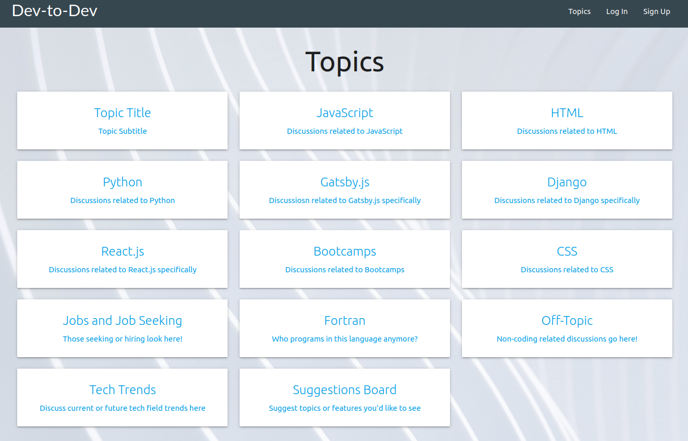
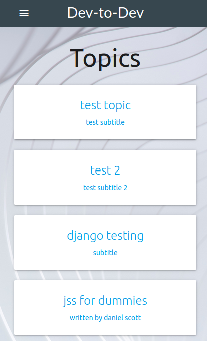
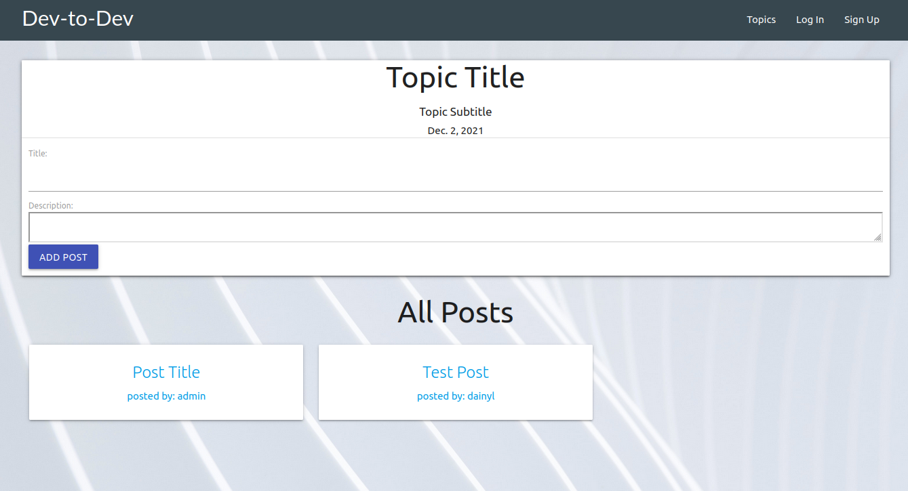
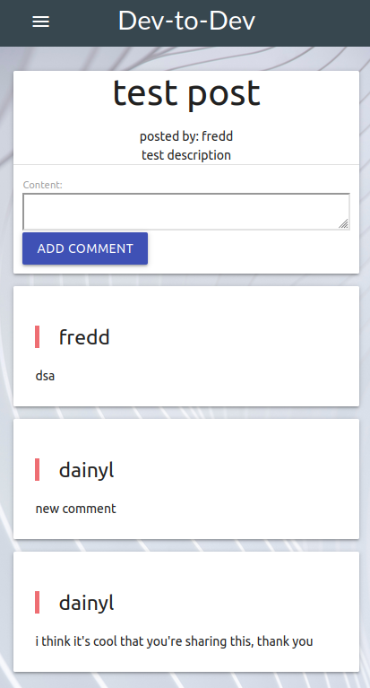

# Dev-to-Dev

Dev-to-Dev allows users, specifically bootcamp students, to browse software development topics of interests and have discussions with other bootcamp students or developers from all over the world. Users do not need to log in to view discussions, but must log in to contribute to them.
 
 
*Developed by Dainyl Cua, Fredd Oropeza, Alexis Pareja, and Brandon Swansfeger*

## Technologies Used

- HTML, CSS, JavaScript
- Materialize CSS
- JQuery
- Python
- Django
- PostgreSql
- Heroku

## Getting Started

**To check out the app, click [here](https://dc-dev-to-dev-test.herokuapp.com/).**

Sign up, log in, or continue as a guest from the landing page. As a guest, you can view discussions on any topics that have been posted. As a user, you can directly contribute to the discussion by creating or replying to a post.

If you want to clone the repository, use the `master` branch for your local repository, and use the `develop-test` branchas a reference for deploying django apps to heroku.

## Screenshots

## Future Enhancements

Check out our progress on Trello [here](https://trello.com/invite/b/0NAHG5BV/5022ef671adaff54eba900e0e7871890/dev-to-dev). This includes our wireframes and future ideas.

- User profiles
- Image upload to posts and comments
- Reply functionality
- Topic or reply notifications
- Timed topic posts
- Topic suggestions
